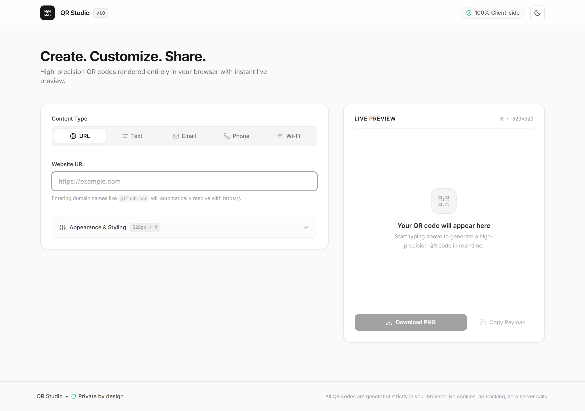
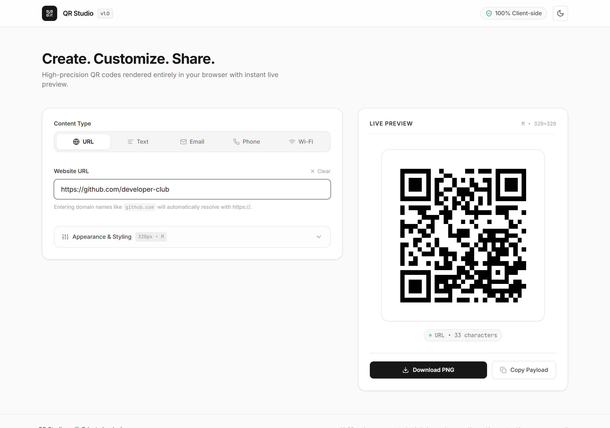
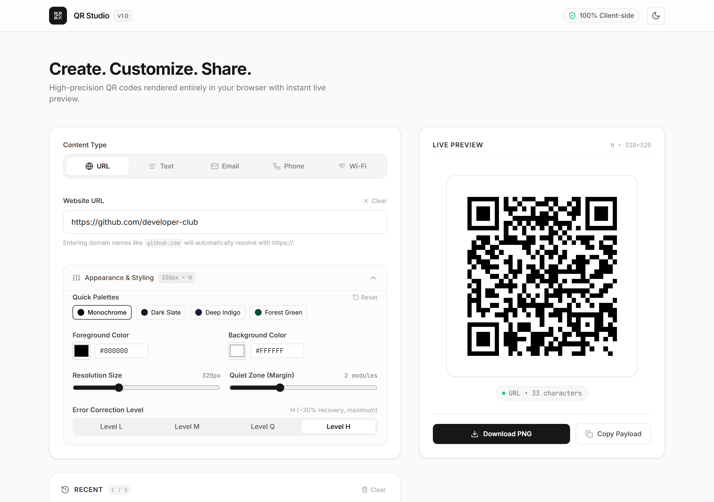
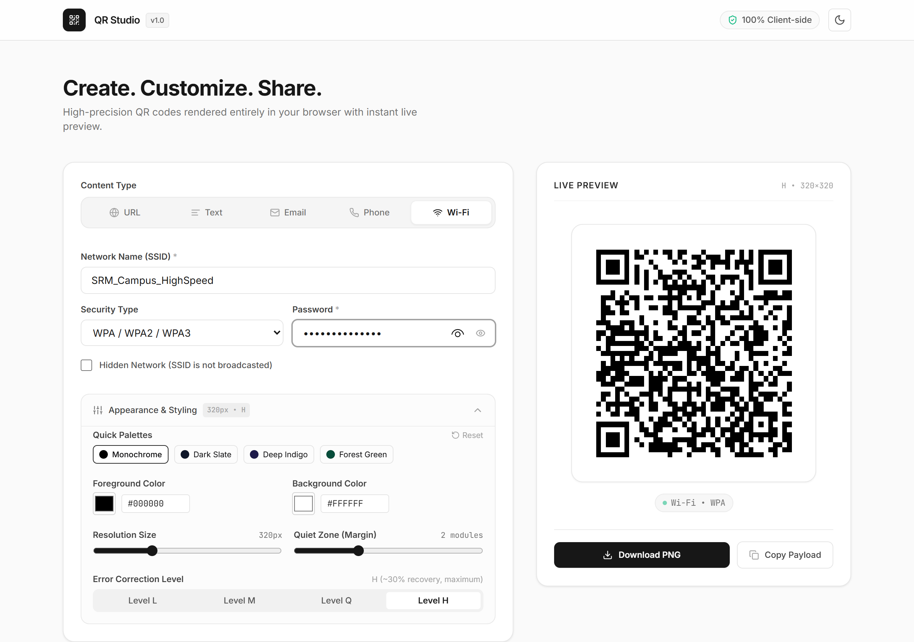
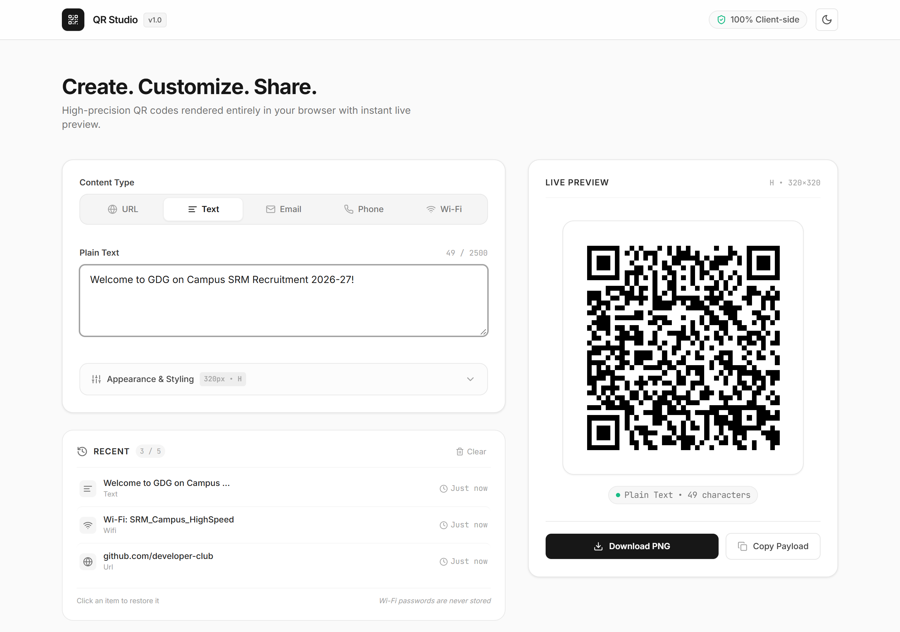
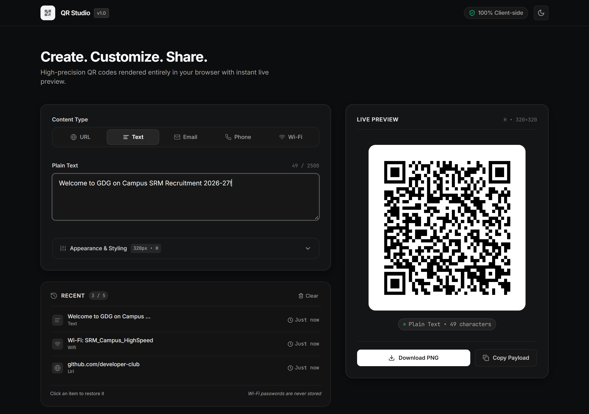
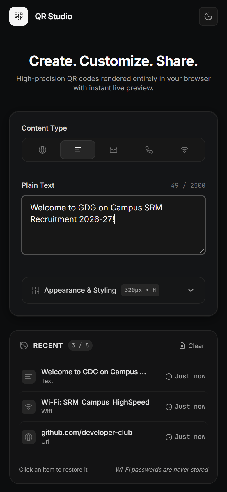

# QR Studio

A fast, private, and restrained QR code generator engineered entirely for the modern web. Built with zero backend dependencies, complete client-side rendering, and a Linear × Raycast inspired aesthetic.

> **GDG on Campus SRM Recruitments 2026–27 Technical Domain Submission**

---

## Overview

Most web-based QR generators are cluttered with intrusive ads, unnecessary account signups, slow cloud APIs, and garish designs. **QR Studio** was built to prove that a utility can be minimal, instant, and private by design. 

All QR matrix computations and canvas rendering occur locally in the user's browser in sub-millisecond execution times. No analytics, no telemetry, no cookies, and no network payloads leave your machine.

---

## Features

- **Multi-Format Content Engine**:
  - **URL**: Automatic protocol resolution (`https://`), domain validation, and parameter preservation.
  - **Plain Text**: Unconstrained raw text encoding with live character counting (up to 2,500 characters).
  - **Email**: RFC 2368 compliant `mailto:` schema support with recipient, subject line, and pre-filled body.
  - **Phone**: E.164 compatible `tel:` schema with instant phone number sanitization.
  - **Wi-Fi**: ZXing-standard `WIFI:S:...;T:...;P:...;H:...;;` format supporting WPA/WPA2/WPA3, WEP, Open networks, and hidden SSIDs.
- **Zero-Latency Live Generation**: Instant canvas updates on keystroke — no cumbersome "Generate" button.
- **Real PNG Download**: High-DPI canvas rasterization with contextual file naming (`qr-url.png`, `qr-wifi.png`, etc.).
- **Clipboard Integration**: One-click copying of raw encoded payloads with fallback support for all browser environments.
- **Precision Customization (Collapsible)**:
  - Custom foreground and background color pickers with hex code inputs.
  - Curated monochromatic & dark slate palette presets.
  - Export resolution sizing slider (200px – 600px).
  - Quiet zone (margin) control (0 – 6 modules).
  - Error correction level adjustment: **L** (~7%), **M** (~15%), **Q** (~25%), and **H** (~30% damage recovery).
  - One-click reset to factory defaults.
- **Privacy-First Recent History**:
  - Local browser storage (`localStorage`) of the last 5 generated QR codes with relative timestamps.
  - One-click restore into active input fields.
  - **Strict Wi-Fi Privacy**: Wi-Fi passwords are intentionally stripped and never persisted into local storage.
  - Single-click history wipe.
- **Adaptive Dark / Light Modes**: Respects system `prefers-color-scheme` with manual toggle and localStorage persistence.
- **Polished Micro-Interactions**: Restrained 150–200ms transitions, tactile button active states, and non-blocking toast notifications.

---

## Tech Stack

- **Framework**: React 18
- **Language**: TypeScript 5.7 (Strict mode)
- **Build Tool**: Vite 6
- **Styling**: Tailwind CSS 3.4
- **QR Generation Engine**: `qrcode` (Pure client-side JavaScript engine)
- **Icons**: Lucide React
- **Architecture**: 100% Client-Side SPA (Zero backend, zero external APIs)

---

## Local Setup

### Prerequisites
- Node.js >= 18.0.0
- npm >= 9.0.0

### Installation & Execution
```bash
# Clone or navigate into the project directory
cd googledevclub

# Install dependencies
npm install

# Start the local development server
npm run dev
```

Open your browser and navigate to:
```
http://localhost:5173
```

To build for production verification:
```bash
npm run build
npm run preview
```

---

## Usage

1. **Select a Content Type**: Choose from `URL`, `Text`, `Email`, `Phone`, or `Wi-Fi` in the segmented tab bar.
2. **Input Details**: Type your content into the focused fields. The QR code appears and refreshes in real-time.
3. **Customize (Optional)**: Expand the **Appearance & Styling** drawer to adjust colors, resolution size, quiet zone margin, or error correction recovery levels.
4. **Export & Share**:
   - Click **Download PNG** to save the crisp image file locally.
   - Click **Copy Payload** to copy the formatted string (e.g. `mailto:...` or `WIFI:...`) to your clipboard.
5. **Revisit**: Use the **Recent** panel below to quickly restore previous configurations.

---

## Architecture

The project adheres to a clean, componentized architecture with strict separation of concerns:

```
src/
├── types/
│   └── qr.ts                 # Type definitions, interfaces, and union schemas
├── utils/
│   ├── qrPayload.ts          # Payload generation, Wi-Fi escaping, metadata formatting
│   ├── validation.ts         # Inline form validation rules and error detection
│   └── download.ts           # Canvas rasterization, PNG downloads, clipboard fallbacks
├── hooks/
│   ├── useTheme.ts           # Theme toggle with localStorage & system preference sync
│   ├── useLocalStorage.ts    # Safe resilient browser storage hook
│   └── useQRGenerator.ts     # Canvas lifecycle and QRCode.toCanvas integration
├── components/
│   ├── Header.tsx             # Brand bar with theme switcher and privacy indicator
│   ├── ContentTypeTabs.tsx    # Accessible segmented keyboard-friendly tablist
│   ├── InputPanel.tsx         # Dynamic input fields with inline error warnings
│   ├── QRPreview.tsx          # Centerpiece canvas, metadata tag, and export buttons
│   ├── CustomizationPanel.tsx # Accordion with palettes, sliders, and EC levels
│   ├── RecentHistory.tsx      # Privacy-preserving history list and item restorer
│   ├── ThemeToggle.tsx        # Subtle rotating light/dark toggle
│   ├── Toast.tsx              # Non-intrusive feedback toast alerts
│   └── Footer.tsx             # Privacy assertion and product statement
├── App.tsx                    # Root composition and unified state container
├── main.tsx                   # React DOM root entrypoint
└── index.css                  # Tailored base tokens, typography smoothing, and scrollbars
```

---

## Privacy

Privacy is the primary design principle of QR Studio:
1. **100% Client-Side**: All QR codes are generated directly using HTML5 Canvas inside your browser. No HTTP requests with your data are ever made.
2. **Wi-Fi Credential Protection**: When saving generated codes to the local history cache, Wi-Fi passwords are stripped out automatically.
3. **No External Analytics**: No Google Analytics, no tracking scripts, no third-party cookies, and no CDN dependencies that track user IPs.

---

## Accessibility

Targeting WCAG 2.2 AA standards:
- **Semantic HTML**: Fully semantic `<header>`, `<main>`, `<section>`, `<aside>`, and `<footer>` elements.
- **ARIA Standards**: Native `role="tablist"`, `role="tab"`, `aria-selected`, `aria-controls`, and `aria-expanded` attributes.
- **Keyboard Navigation**: Full keyboard operability across tabs (arrow keys), inputs, sliders, and action buttons.
- **Focus Indicators**: Explicit high-contrast focus rings (`focus-visible:ring-2`) for all interactive controls.
- **Accessible Contrast**: Strict contrast ratios adhering to standard readability guidelines in both Light and Dark palettes.
- **Accessible Error States**: Clear text labels and warning icons accompanying input errors — never relying solely on color.

---

## Screenshots

### 01. Landing Experience (Light Mode & Empty State)


### 02. Live URL QR Generation


### 03. Customization & Error Correction Drawer


### 04. Wi-Fi Configuration with Password Obfuscation


### 05. Recent History with Privacy Protection


### 06. Restrained Dark Mode


### 07. Fully Responsive Mobile Layout (390px)


---

## Design Decisions

- **Restrained Monochromatic Palette**: Rather than flashy neon gradients, the interface uses pure whites, slate neutrals, and deep zinc tones to ensure the QR code remains the visual focal point.
- **Zero-Friction Landing**: There is no marketing hero or secondary screen. The application is immediately interactive from the instant it mounts.
- **Live Reactivity**: Elimination of the "Generate" button reduces interaction cost to zero, reflecting modern desktop utility standards (Linear / Raycast).
- **Collapsible Configuration**: Advanced options (margins, resolution, error correction) are discreetly tucked into a secondary disclosure to keep the primary view uncluttered.

---

## Future Improvements

- SVG vector export format alongside PNG rasterization.
- Embedded custom center logo placement with automatic error correction scaling.
- Batch generation via CSV / JSON file drop.
- vCard / MeCard comprehensive contact card support.

---

## License

MIT © 2026 QR Studio. Built for GDG on Campus SRM Recruitments.
